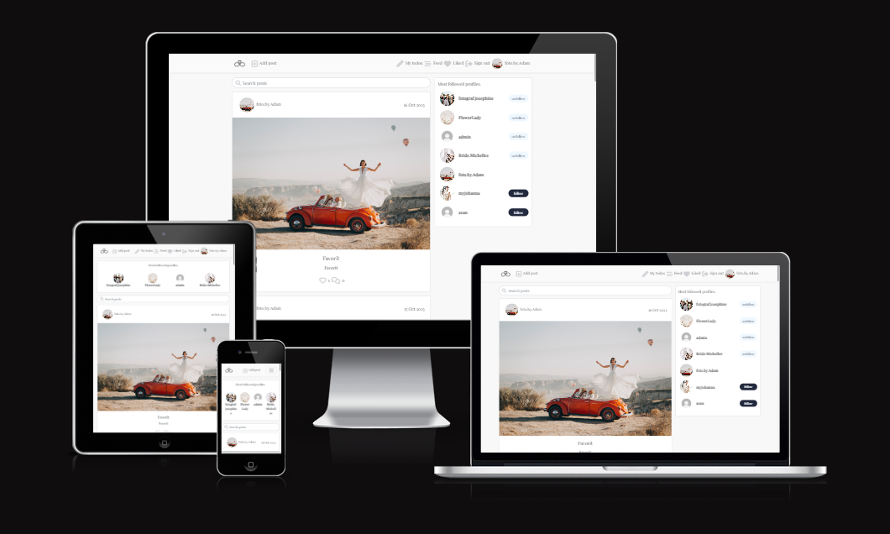

# My Wedding Planner 

### Portfolio Project 5 Advanced Frontend 

My Wedding Planner is an image sharing and networking platform for weddings. As a future bride and groom, you can find inspiration for your big day. The site is also perfect for wedding photographers and florists as their work is perfect for the target audience of the site. As a photographer, you can market yourself and find many new clients.

### Live wedsite here: [My Wedding Planner](https://my-wedding-planner-300e07d6f1f5.herokuapp.com/)

- [Project](#project)
- [User Experience](#user-experience-ux)
- [Wireframes](#wireframes)
- [Design](#design)
- [Features](#features)
- [Future features & improvments](#future-features--improvments)
-[Components & hoos](#components-and-hooks)
- [Technology](#technology)
- [Testing](#testing)

# Project 
The objective of this project was to create a fifth portfolio project for Code Institutes program, Full Stack SoftWare Developer. The website is build using React, JSX, CSS and its connected to a beckend API build with Django Rest Framework.
The application contains full CRUD functionallity to create, update and delete posts and todos. 

The project is based on the course material Moments walketrough.

## Site User Goal
Users of My Wedding coukld have several goals, sush as wanting to share there own posts and take part of others users posts. Networking with people 
with the same interests as you. Maybe you will find new friends who are also getting married and can share thoughts and ideas with them.

Or maybe you are a photographer and wants to be discovered by potential customers. On My Wedding you have the right target group right in front of you.

## Owner User Goal
As a siteowner the goal is to provide a stable and enjoyable user experience. The website should be accessible, appealing and contain content that is well structured.

## Planning the project

Github project board was used in the process of building this wedsite. This process helped me keep track of which user stories was in progress and which was done. Issues that wont be finished before the deadline of project in added to the - [Project board](https://github.com/users/Myekman/projects/7)

### User Experience
To plan the project GitHub issues was used to write all User Stories and also Bugs trough development. 

- [User Stories](https://github.com/Myekman/my-wedding/issues)
- [Bugs](https://github.com/Myekman/my-wedding/issues)

### Wireframes
Wireframes created using [Balsamiq](https://balsamiq.com/) to plan the general design on lager and smaller screen sizes. 

#### Homepage / feed / Liked posts
This pages has the same design but the it display's diffrent kinds of posts. Feed is only displaying posts from the profiles i follow. Homepage displays all posts and liked displays all liked posts from the logged in profile. 

[Home,Feed,Liked](src/assets/readme/homepage.pp5.png)

[ProfilePage](src/assets/readme/profilepage.ppg.png)

[Add post page](src/assets/readme/addposts.ppf.png)

[Todo page & TodoForm](src/assets/readme/todopage.ppg.png)

# Design

### Typography
The font  throughout the website is Playfair Display imported fron [Google Fonts](#https://fonts.google.com/)

### Color Sheme
the color sheme is at the most part grey and discret to match easily with all shared images on the site. Accentcolors on buttons are pink and green 
to achieve a romantic feeling.  

## Images

Images that is uploaded are imported frpn [Pexles](#https://www.pexels.com/)

# Featues

# Future features & improvments

### Todolist can be checked as done 
To keep track of the planning, it would be good if you could save all the todos but only check them off as done when they are completed. 

### The design of Todolist can be imporoved
the design can be improved for a better user experience. Maybe save each todo in a card to make it look cleaner.

### Delete comments
Post owner can delete unwanted comments on their own posts.

### Create a budget page
Budget page so that the bride and groom can keep track of how much the whole party will cost. There they can enter prices for everything that is booked and to be booked before the big day.

# Components & hooks

## Components
My Wedding contains unique components that has been used in this project.

#### 1. Asset: 
- A loading spinner
- Image 
- Message 

2. Avatar
Displays the profile image.

3. MoreDropDowm:
Displays the dropdown menu of edit or deleting posts or todos.

4. Navbar
Displays he navbar at the top of the site trough entire website. 

5. NotFound
Used with the Asset component and displays a message for the user if they navigate to a non existing url.

## Hooks

- useClickOutsideToggle: provides a convenient way to handle the closing of the navbar and can be implemented in feature featues if needed.
- useRedirect: redirects the user depending on user authorization status.

# Technology

## Languages
- JSX 
- HTML 
- CSS
- JavaScript
- Python

## Frameworks
- React
- React Bootstrap
- Django Rest Framework

# Testing

